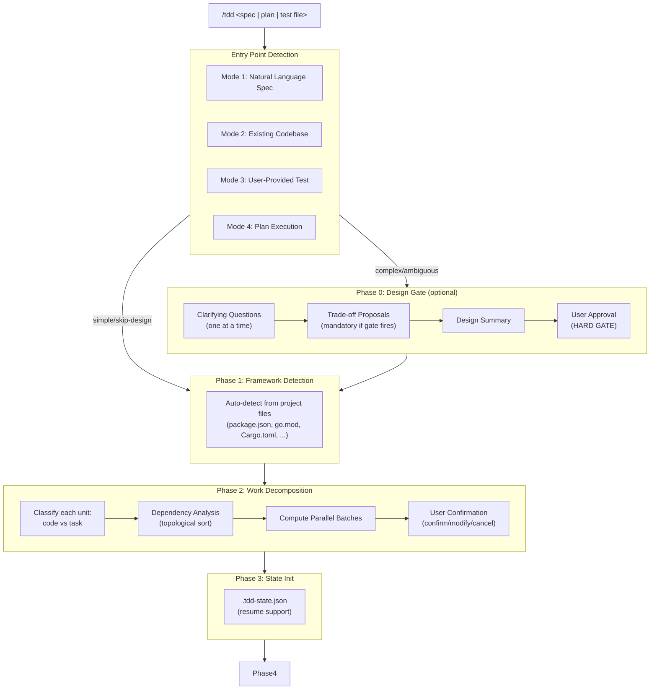
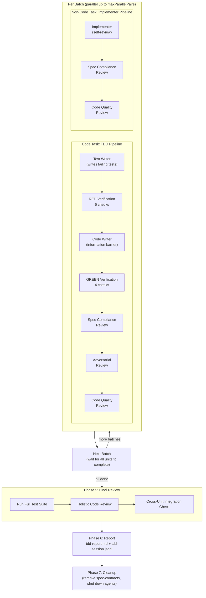
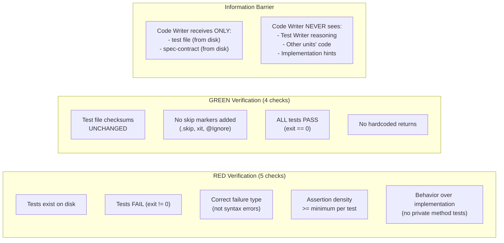
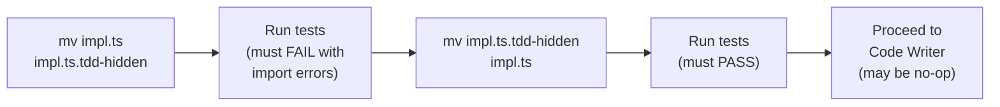
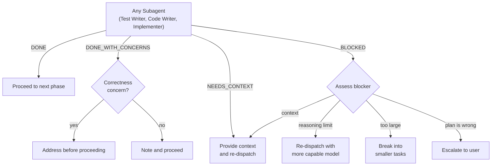
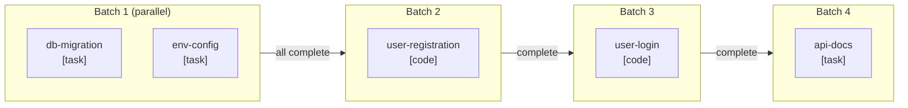
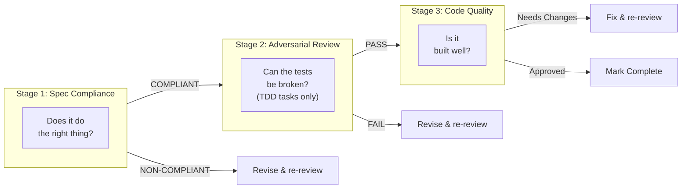

# Agentic TDD — Architecture Diagram

## High-Level Pipeline

## Phase 4: Agent Team Orchestration

## Anti-Cheat Guardrails

## Coverage Mode RED (Mode 2 Adaptation)

## Subagent Status Protocol

## Parallel Execution Model

## Three-Stage Review Pipeline

